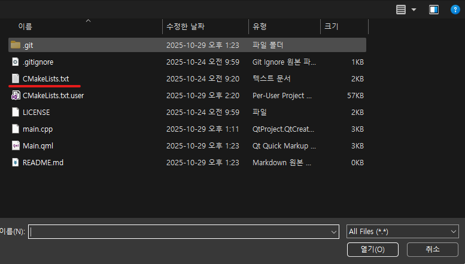
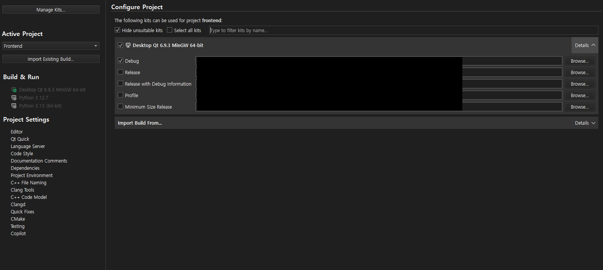
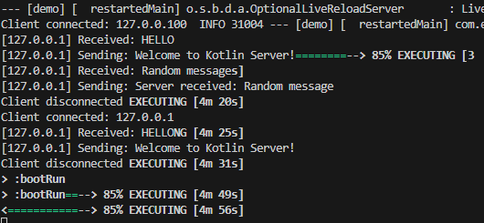

## How to Run
1. git clone ~
2. cd backend
3. gradlew bootRun
4. Install Qt6 and Qt Creator
5. Open project with Qt Creator (You should choose CMakeLists.txt)

6. Configure project

7. Run (Press F5 Key in Qt Creator)

## Preview
### Client
<video controls src="Result.mp4" title="Title"></video>
### Server
